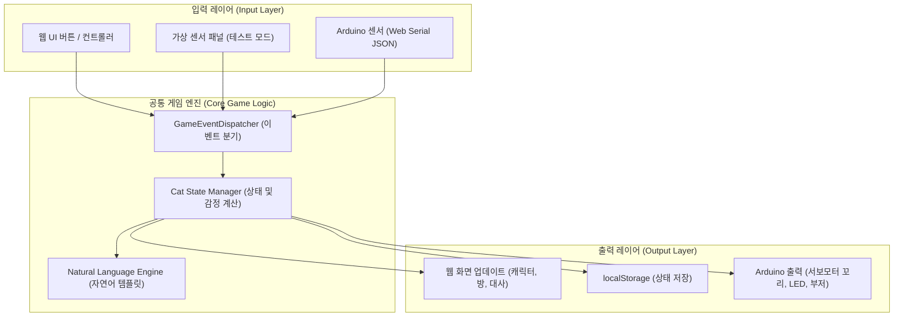

# 🐾 Cat Room

> **프로젝트 안내:** `Cat Room`은 2026년 여름방학 프로토타이핑 캠프의 **1인(개인) 프로토타이핑 프로젝트**로, AI 어시스턴트 Antigravity와 협업하여 개발을 진행합니다.

**Arduino × Web Serial 기반 인터랙티브 고양이 육성 & 방 꾸미기 웹 캔버스**

---

## 📌 프로젝트 소개

`Cat Room`은 화면 속 귀여운 반려묘를 돌보고 자신만의 방을 꾸미는 **웹 기반 육성 프로토타입 게임**입니다.

웹 브라우저 단독으로 완결된 고양이 육성 및 인테리어 경험을 제공하며, 선택적으로 **Arduino UNO**와 물리 센서/액추에이터를 USB 시리얼로 연결하여 현실 공간의 물리적 자극(터치, 밝기, 거리, 버튼 등)을 게임 내 고양이의 감정과 행동 반응으로 연동할 수 있습니다.

본 프로젝트는 2026년 여름방학 **Arduino × Prototyping Camp**의 핵심 과제로, **Antigravity AI 프로그래밍 도구**를 활용한 프롬프트 중심 프로토타이핑(Prompt-Driven Prototyping) 실증 연구를 위해 제작됩니다.

---

## 💡 제작 배경

1. **디지털과 피지컬 컴퓨팅의 유기적 결합**
   * 기존 피지컬 컴퓨팅 프로젝트는 하드웨어 센서의 단발성 작동에 그치는 경우가 많았습니다.
   * `Cat Room`은 소프트웨어(웹 게임) 중심에 아두이노를 '선택형 입력/출력 인터페이스'로 레이어링하여 풍부한 몰입감을 제공합니다.
2. **센서 기반 감정 교감 프로토타이핑**
   * 단순 버튼 입력을 넘어 조도, 초음파 거리, 터치 센서를 통한 자연스러운 교감(어두워지면 수면, 가까이 오면 호기심 표현 등)을 실험합니다.
3. **프롬프트 중심 프로토타이핑 실험**
   * 요구사항 정의, 문서화(PRD), 템플릿 로직, 아두이노 프로토콜 정의까지 AI 파트너(Antigravity)와 협업하여 신속한 반복 개발 및 검증을 목표로 합니다.

---

## 🎮 웹게임 핵심 기능

* **고양이 커스터마이징 & 상태 관리**: 고양이 이름 설정, 5가지 핵심 기분/생체 지수(배고픔, 행복도, 친밀도, 에너지, 스트레스)에 따른 실시간 상태 변화.
* **상호작용 돌보기**: 밥 주기, 쓰다듬기, 놀아주기, 재우기 등 행동에 따른 유기적 상태 전환 및 수용/거부 반응.
* **행동 상태 & 표현력**: 8가지 행동 상태(기본, 행복, 배고픔, 졸림, 수면, 놀람, 화남, 무관심)에 맞춘 커스텀 애니메이션 및 템플릿 기반 자연어 반응 문구.
* **고양이 방 꾸미기 (슬롯 방식)**: 벽지, 바닥, 침대, 밥그릇, 캣타워, 쿠션, 장난감, 창밖 배경, 벽 장식의 9개 슬롯 구성. 상호작용 업적 및 아두이노 연결에 따른 아이템 해금 시스템.
* **방 캡처 & 이미지 다운로드**: 현재 꾸민 방과 고양이 표정, 이름, 촬영일, 상태 문구가 담긴 포토 카드를 단일 이미지로 캡처하여 다운로드.
* **클라이언트 로컬 저장소**: 브라우저 `localStorage` 기반 상태 자동 저장 및 데이터 초기화 기능.

---

## 🔌 Arduino 확장 기능 (선택형)

> ⚠️ **Arduino가 연결되지 않아도 웹게임의 모든 기능은 100% 정상 작동합니다.**

* **터치 센서**: 물리적 터치를 감지하여 웹의 쓰다듬기 실행 (짧은 터치 / 긴 터치 구분).
* **먹이 버튼**: 물리 버튼 클릭을 통한 밥 주기 수행.
* **조도 센서**: 현실 공간의 밝기를 감지하여 웹 방의 낮/밤 모드 전환 및 고양이의 수면 유도.
* **초음파 거리 센서**: 사용자 접근 속도(천천히/갑자기/멀어짐)를 감지하여 호기심/놀람/휴식 반응 연동.
* **서보모터 꼬리**: 고양이의 기분 상태(행복/스트레스/수면 등)를 현실의 꼬리 모션으로 피드백.
* **LED & 부저**: 상태 표현 및 상호작용 사운드 효과음 출력.

---

## 🔄 전체 동작 흐름

---

## 📦 MVP 범위 vs 향후 확장 방향

### 🎯 초기 MVP 범위
* 브라우저 기반 독립형 웹 애플리케이션 (별도 서버/DB 없음).
* Web Serial API를 활용한 USB 시리얼 통신.
* 가상 센서 테스트 모드 제공.
* 템플릿 기반 자연어 반응 로직.
* 슬롯 형태의 방 꾸미기 및 해금 시스템.
* 방 포토 카드 로컬 다운로드.

### 🔮 향후 확장 방향 (Post-MVP)
* 카카오톡 이미지 공유 및 나와의 채팅 자동 전송.
* Supabase 기반 계정/데이터 동기화 및 친구 방 방문.
* LLM 기반 실시간 대화 및 고양이 일기 생성.
* RFID 센서를 통한 사용자별 친밀도 식별.
* 무선 오디오 모듈 및 무선 연결 지원.

---

## 🤖 Antigravity를 활용한 프롬프트 중심 개발 방식

본 프로젝트는 AI 코딩 어시스턴트 **Antigravity**를 개발 파트너로 활용합니다.
1. **기획 & PRD 고도화**: 프롬프트 질의를 통한 요구사항 도출 및 체계적인 PRD/아키텍처 명세 작성.
2. **규격화된 통신 모듈 설계**: Web Serial API 표준 및 JSON 프로토콜 명세 사전 합의.
3. **컴포넌트 단위 반복 구현**: 테스트 제어 가능성(Virtual Sensor Mode)을 확보한 상태에서 단계별 코드 생성 및 검증.

---

## 🚧 현재 개발 상태

* **현재 단계**: 📋 **Phase 1. 기획 및 사양 확정 (PRD 명세 작성 완료)**
* **다음 단계**: 💡 **사용자 질문(확인 필요 사항) 답변 수령 및 PRD 최종 확정 후 MVP 개발 착수 예정**
