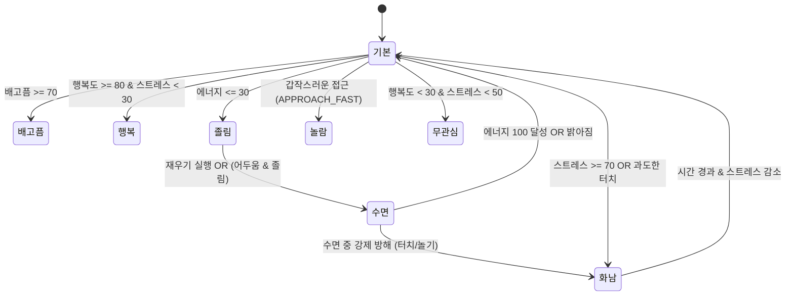
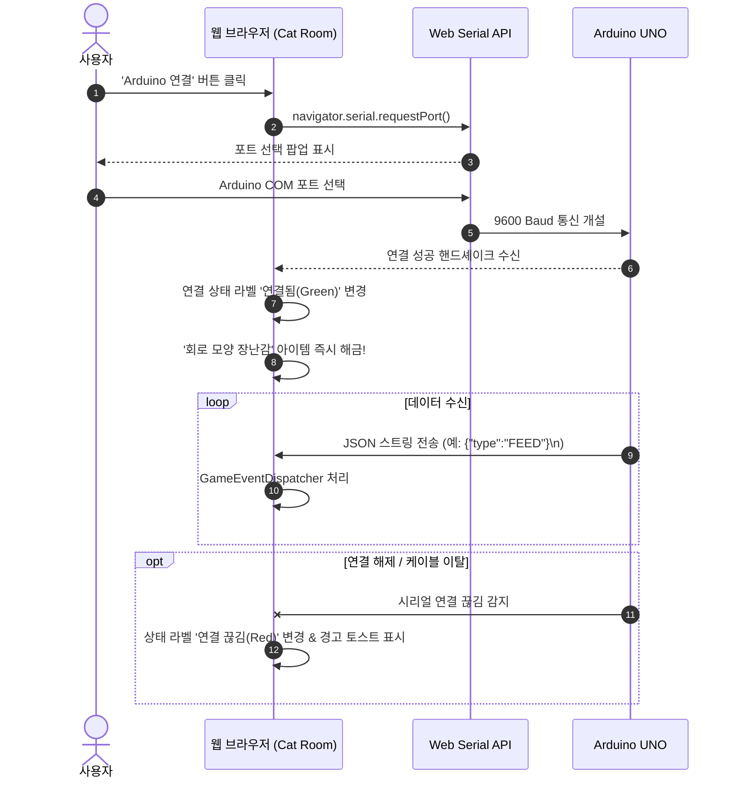

# 📋 Product Requirement Document (PRD)

| 항목 | 내용 |
| :--- | :--- |
| **프로젝트명** | Cat Room (확정 명칭, 1인 개발 프로젝트) |
| **문서 버전** | v1.0.0 |
| **작성일자** | 2026-07-31 |
| **작성자** | 시니어 프로덕트 매니저 (Antigravity AI 협업) |
| **대상 행사** | 2026년 여름방학 Arduino × Prototyping Camp |
| **문서 상태** | Finalized (모든 기획 파라미터 1-A, 2-A, 3-A, 4-A 확정 완료) |

---

## 1. 문서 개요

본 문서는 2026년 여름방학 **Arduino × Prototyping Camp**에서 제작할 웹 기반 고양이 육성 게임 및 Arduino 피지컬 인터랙션 확장 프로젝트(`Cat Room`)의 전반적인 제품 요구사항, 데이터 구조, 하드웨어 연동 규격 및 개발 인수 조건을 정의합니다.

본 문서는 프롬프트 중심 프로토타이핑(Prompt-Driven Prototyping)의 일환으로 작성되었으며, 확정된 요구사항을 바탕으로 구체적인 기술 명세와 기능적 세부사항을 포함합니다.

---

## 2. 제품 요약

`Cat Room`은 사용자가 웹 브라우저 상에서 귀여운 일반 고양이를 돌보고 고양이의 방을 자유롭게 꾸미며 교감하는 **웹 기반 캐주얼 육성 샌드박스 게임**입니다.

* **독립적 웹 제품**: 별도의 서버, 백엔드 DB, 또는 Arduino 연결 없이도 브라우저 단독으로 모든 핵심 기능(돌보기, 상태 변화, 반응 문구, 방 꾸미기, 이미지 캡처, 로컬 저장)이 complete 되도록 동작합니다.
* **선택형 피지컬 확장**: **Arduino UNO**를 USB 시리얼(Web Serial API)로 연결할 경우, 터치, 버튼, 조도, 초음파 센서를 통해 현실 공간의 자극을 웹 게임 속 고양이의 감정과 행동으로 전달하며, 서보모터 꼬리와 LED/부저로 현실에 피드백을 제공합니다.

---

## 3. 제작 배경

1. **디지털과 피지컬 컴퓨팅의 시너지 창출**
   * 기존 하드웨어 중심 프로토타이핑은 LED 반짝임이나 단순 수치 표시에 머물러 시각적 만족도와 몰입감이 부족한 한계가 있었습니다.
   * 풍부한 그래픽 UI와 연출을 갖춘 웹 게임을 중심축으로 두고, Arduino를 선택형 실물 인터페이스로 결합하여 프로토타이핑 만족도를 극대화합니다.
2. **캠프 참가자를 위한 높은 개발 접근성**
   * 서버 구축 및 모바일 앱 패키징의 복잡성을 배제하고, 브라우저 표준 기술(HTML/JS, `localStorage`, Web Serial API)만으로 동작하는 가벼운 아키텍처를 채택합니다.
3. **프롬프트 중심 프로토타이핑(Antigravity) 실험**
   * 기획 단계부터 명세 작성, 코드 생성, 센서 프로토콜 정의까지 프롬프트 기반으로 신속하게 전개할 수 있는 표준 모델을 제시합니다.

---

## 4. 문제 정의

| 문제점 | 해결 방안 |
| :--- | :--- |
| **하드웨어 단독 프로젝트의 몰입감 한계**<br>센서 반응이 서보모터나 LED에 국한되어 지속적인 유저 흥미 유발 어려움 | 귀여운 고양이 캐릭터의 다양한 표정, 방 꾸미기 요소, 감정 상태별 자연어 반응을 웹 UI로 구현하여 감정적 몰입 제공 |
| **Arduino 미보유 시 서비스 이용 불가 위험**<br>장비가 없거나 통신 에러 발생 시 전체 프로젝트 시연 불가능 | 웹게임 단독으로 100% 동작 보장 + 웹 UI 내 '가상 센서 테스트 모드' 탑재 |
| **복잡한 서버/회원가입으로 인한 진입 장벽**<br>캠프 환경에서 네트워크 환경 설정 및 계정 관리가 시연 저해 요인으로 작용 | 서버 및 회원가입 배제, `localStorage` 기반 클라이언트 단독 실행 구조 채택 |

---

## 5. 제품 목표

1. **완결성 있는 웹 육성 게임 구현**: 단일 브라우저 접속으로 고양이 육성, 방 꾸미기, 캡처 및 저장 경험을 완벽히 제공.
2. **일동형(Unified) 이벤트 아키텍처 구축**: 웹 UI 버튼 이벤트와 Arduino 시리얼 이벤트가 동일한 핵심 게임 로직을 공유하는 구조 달성.
3. **직관적이고 귀여운 피드백 연출**: 5가지 상태 수치와 8가지 행동 상태에 따른 풍부한 시각적/문맥적 자연어 반응 전달.
4. **쉬운 하드웨어 프로토타이핑 환경 제공**: 가상 센서 모드를 통해 하드웨어 없이도 소프트웨어 검증이 가능하도록 지원.

---

## 6. 비목표 (Non-Goals)

다음 기능은 초기 MVP 버전의 범위에서 명확히 제외하며, 향후 확장 단계로 분류합니다.
* 회원가입, 로그인 및 계정 인증 시스템 (Supabase / OAuth 등)
* 백엔드 API 서버 및 클라우드 데이터베이스 연동
* 카카오톡 로그인, 카카오톡 이미지 공유 및 나와의 채팅 자동 전송
* 사용자 간 친구 추가, 방문 및 소셜 네트워크 기능
* 유료 아이템 결제 및 온라인 인게임 상점
* iOS / Android 네이티브 모바일 애플리케이션 제작
* LLM(대형 언어 모델) 기반 실시간 대화/일기 생성 API 연동
* 실제 고양이 의료/건강 진단 기능
* 웹캠을 통한 실제 사용자 사진 촬영 기능
* Bluetooth / Wi-Fi 등 Arduino 무선 통신 (USB 시리얼만 지원)

---

## 7. 주요 사용자

1. **2026 Arduino × Prototyping Camp 참가자 및 심사위원**: 피지컬 컴퓨팅 센서와 웹 UI 간의 매끄러운 연동을 시연하고 평가하는 사용자.
2. **캐주얼 데스크톱 웹게이머**: 가볍게 고양이를 돌보고 방을 꾸미며 힐링을 얻고자 하는 사용자.

---

## 8. 제품 원칙

1. **웹 중심성 (Web-First)**: 웹 기반 고양이 육성 게임이 제품의 절대적 중심입니다.
2. **Arduino 선택성 (Optional Hardware)**: Arduino UNO는 필수가 아닌 선택형 확장 기능이며, 하드웨어 미연결 시에도 모든 기능이 정상 동작해야 합니다.
3. **단일 로직 원칙 (Single Logic Principle)**: 웹 버튼과 Arduino 센서 입력은 각각 별도 함수를 작성하지 않고 동일한 게임 파이프라인(`GameEventDispatcher`)을 호출해야 합니다.
4. **현실적이고 개성 있는 반응 (Non-Linear Behavior)**: 고양이는 사용자의 행동에 무조건 긍정적으로 반응하지 않으며, 현재 상태와 이전 행동에 따라 거부/짜증/수면 등 다양한 반응을 보입니다.
5. **시각적 & 문맥적 즉각 피드백 (Visual & Contextual Feedback)**: 행동 즉시 고양이 표정, 애니메이션, 상태 수치, 자연어 템플릿 문구가 동시에 변경됩니다.
6. **서버리스 클라이언트 실행 (Zero-Server Architecture)**: 초기 버전은 백엔드 서버 없이 브라우저 단독으로 실행 가능해야 합니다.
7. **실감나는 캐릭터성 (Cute Standard Cat)**: 웹 화면에는 귀여운 일반 고양이 캐릭터가 등장하며, 하드웨어나 회로 형태의 고양이 캐릭터로 대체하지 않습니다.
8. **안전한 테스터빌리티 (Testability)**: 실제 아두이노가 없어도 개발 및 테스트가 가능하도록 웹 화면 내 가상 센서 컨트롤러를 제공합니다.

---

## 9. 핵심 사용자 흐름 (Key User Flows)

### Flow 1: 최초 접속 및 온보딩
```
[웹 접속] ──> [온보딩 모달: 고양이 이름 입력] ──> [초기 고양이 상태 및 기본 방 생성] ──> [메인 화면 진입]
```

### Flow 2: 돌보기 및 반응 루프
```
[유저 행동 선택 (웹 버튼 OR Arduino 센서)] 
     │
     ▼
[GameEventDispatcher: 이벤트 유형 전달]
     │
     ▼
[Game Engine: 현재 고양이 상태값 검증 및 수치 변경]
     │
     ▼
[행동 상태 판단 (8가지 중 결정)] ──> [자연어 템플릿 선택]
     │
     ▼
[화면 갱신 (애니메이션 + 템플릿 대사 + 수치 바)] ──> [localStorage 자동 저장] ──> [Arduino output (서보모터/LED)]
```

### Flow 3: 방 꾸미기 및 아이템 해금
```
[방 꾸미기 버튼 클릭] ──> [슬롯별 아이템 선택 드로어] ──> [해금 조건 체크 (업적/친밀도 등)]
     │                                                            │
     ▼ (해금 완료 아이템)                                          ▼ (미해금 아이템)
[방 화면 즉시 변경 및 저장]                                  [해금 조건 안내 툴팁 표시]
```

### Flow 4: 방 포토 카드 캡처
```
[캡처 버튼 클릭] ──> [고양이 방 + 표정 + 이름 + 날짜 + 상태 문구 렌더링] ──> [PNG 이미지 생성] ──> [로컬 저장소 다운로드]
```

### Flow 5: Arduino 연결 흐름
```
[Web Serial 연결 버튼] ──> [브라우저 포트 선택 팝업] ──> [Arduino 선택 & 연결] ──> [상태 표시등 '연결됨' 전환]
```

---

## 10. 화면 목록

| 화면 ID | 화면 명칭 | 설명 |
| :--- | :--- | :--- |
| **SCR-01** | 온보딩 모달 | 최초 접속 시 고양이 이름을 설정하는 레이어 모달 |
| **SCR-02** | 메인 고양이 방 (캔버스) | 고양이 캐릭터, 꾸며진 방 요소, 감정 상태 대사창, 5대 상태 수치 HUD가 표시되는 메인 화면 |
| **SCR-03** | 돌보기 패널 | 밥 주기, 쓰다듬기, 놀아주기, 재우기 버튼 모음 |
| **SCR-04** | 방 꾸미기 드로어 | 9개 카테고리 슬롯별 아이템 선택 및 해금 상태 확인 패널 |
| **SCR-05** | 포토 카드 캡처 모달 | 캡처 이미지 미리보기 및 로컬 다운로드 버튼 제공 |
| **SCR-06** | 가상 센서 테스트 패널 | 아두이노 센서 이벤트를 수동 트리거할 수 있는 개발자/시연용 테스트 바 |
| **SCR-07** | Arduino 통신 설정 바 | Web Serial 포트 연결/해제 및 통신 상태 라벨 |

---

## 11. 웹 기능 요구사항

### 11.1 고양이 설정 (Cat Setup)
* 사용자가 처음 접속했을 때 이름 설정 모달(SCR-01)을 띄웁니다.
* 캐릭터는 시각적으로 친근하고 귀여운 일반 2D/일러스트 고양이 캐릭터로 표현합니다. (회로/아두이노 보드 형태 캐릭터 사용 불가)
* 이름은 1~12자 이내로 설정 가능하며, 이후 언제든지 환경설정에서 수정 가능합니다.

### 11.2 틱 기반 자동 상태 변화 `[제안 사항]`
* 게임 플레이 중 일정 시간(예: 매 30초, `Tick`)마다 상태값이 자동으로 변동됩니다.
  * 배고픔: +3 증가
  * 에너지: -2 감소 (수면 중이 아닐 때)
  * 스트레스: -1 감소 (안정 상태일 때 자연 감소)

---

## 12. 고양이 상태 모델 (Cat State Model)

고양이는 5가지 연속적 수치 지수를 가지며, 각 수치는 **0 ~ 100** 사이의 정수 범위로 제한됩니다.

| 상태 수치 (Metric) | 범위 | 기본값 | 설명 | 수치 변경 요인 |
| :--- | :--- | :--- | :--- | :--- |
| **배고픔 (Hunger)** | 0 ~ 100 | 30 | 높을수록 배가 고픈 상태 (100 = 극심한 허기) | 밥 주기(-30), 틱 흐름(+3), 놀아주기(+10) |
| **행복도 (Happiness)**| 0 ~ 100 | 70 | 높을수록 기분이 좋은 상태 | 놀아주기(+20), 쓰다듬기(+10), 거부 반응 발생(-15) |
| **친밀도 (Affection)** | 0 ~ 100 | 20 | 높을수록 플레이어와의 관계가 깊음 | 적절한 쓰다듬기(+5), 밥 주기(+3), 스트레스 극심 시(-5) |
| **에너지 (Energy)** | 0 ~ 100 | 80 | 높을수록 활력이 넘침 | 재우기(+40/분), 놀아주기(-25), 틱 흐름(-2) |
| **스트레스 (Stress)** | 0 ~ 100 | 10 | 높을수록 민감하고 화가 난 상태 | 과도한 연속 쓰다듬기(+15), 배부른데 밥주기(+20), 수면 방해(+30), 시간 경과(-1) |

---

## 13. 행동 상태와 전환 조건

고양이는 5가지 수치 지수와 유저 상호작용에 의해 **8가지 행동 상태(Behavioral State)** 중 하나로 확정됩니다.



### 8대 행동 상태 정의 및 전환 명세

| 행동 상태 | 주요 전환/유지 조건 | 표정 및 행동 연출 | 반응 특성 |
| :--- | :--- | :--- | :--- |
| **기본 (Idle)** | 특이 극단 조건이 없는 일반 상태 | 편안한 눈, 주기적 끔벅임 | 일반적인 반응 문구 출력 |
| **행복 (Happy)** | 행복도 ≥ 80 및 스트레스 < 30 | 눈을 감고 미소, 골골송 효과음 | 애교 섞인 반응, 친밀도 추가 상승 |
| **배고픔 (Hungry)** | 배고픔 ≥ 70 | 밥그릇을 바라보며 아쉬운 표정 | 밥 주기 수용률 100%, 놀기 거부 가능성 |
| **졸림 (Sleepy)** | 에너지 ≤ 30 | 하품 애니메이션, 무거운 눈꺼풀 | 놀아주기 요청 시 거부 반응 |
| **수면 (Sleeping)** | 재우기 클릭 OR 조도 센서 DARK 지속 | Zzz 말풍선, 눈 감고 엎드림 | 방해할 경우 스트레스 폭증 및 화남 전환 |
| **놀람 (Startled)** | `APPROACH_FAST` 이벤트 수신 | 귀를 젖히고 눈이 커짐 | 일시적 털 곤두섬, 빠른 서보모터 꼬리 털기 |
| **화남 (Angry)** | 스트레스 ≥ 70 OR 거부 조건 3회 연속 | 찌푸린 눈, 르르렁 효과음 | 모든 스킨십 및 먹이 거부 |
| **무관심 (Indifferent)**| 행복도 < 30 및 스트레스 30~60 | 딴 곳을 바라봄, 고개 돌림 | 반응 문구가 퉁명스럽거나 무반응 |

---

## 14. 자연어 반응 규칙

초기 MVP에서는 LLM API를 호출하지 않고, **상태-이벤트 매칭 템플릿 엔진**을 사용합니다. 각 템플릿 카테고리당 3개 이상의 변형 문장을 두어 무작위 선출함으로써 단조로움을 방지합니다. `[제안 사항]`

### 대표 자연어 반응 규칙 테이블

| 상호작용 | 고양이 조건 | 선택 템플릿 예시 (무작위 1종) | 상태 변화 결과 |
| :--- | :--- | :--- | :--- |
| **밥 주기** | 배고픔 ≥ 50 (정상) | • "기다렸다는 듯 밥그릇으로 달려갔다."<br>• "허겁지겁 사료를 비워냈다." | 배고픔 -30, 친밀도 +3 |
| **밥 주기** | 배고픔 < 20 (배부름) | • "밥그릇을 한번 보고는 등을 돌렸다."<br>• "냄새만 살짝 맡고 관심 없는 듯 꼬리를 쳤다." | 스트레스 +15, 먹이 거부 애니메이션 |
| **쓰다듬기** | 스트레스 < 40 (정상) | • "기분이 좋은지 눈을 가늘게 떴다."<br>• "손길에 맞춰 고개를 삐걱 밀어붙인다." | 친밀도 +5, 행복도 +10 |
| **쓰다듬기** | 연속 4회 이상 (과도함) | • "지금은 혼자 있고 싶은 것 같다."<br>• "귀를 젖히며 손을 톡 쳤다." | 스트레스 +20, 화남 상태 전환 |
| **놀아주기** | 에너지 ≥ 40 (정상) | • "장난감을 향해 펄쩍 튀어 올랐다!"<br>• "눈을 반짝이며 신나게 낚싯대를 쫓는다." | 행복도 +20, 에너지 -20 |
| **놀아주기** | 에너지 < 30 (피곤함) | • "지금은 놀고 싶지 않은 모양이다."<br>• "장난감을 무심하게 바라보며 누워버렸다." | 행동 거부, 스트레스 +10 |
| **수면 방해** | 수면 (Sleeping) 중 | • "잘 자고 있는데 건드려 짜증이 난 것 같다!"<br>• "하악질을 하며 딴 곳으로 자리를 옮겼다." | 스트레스 +30, 화남 상태 전환 |
| **거리 접근** | `APPROACH_SLOW` | • "호기심 어린 눈으로 살금살금 다가온다." | 행복도 +5 |
| **거리 접근** | `APPROACH_FAST` | • "깜짝 놀라 구석으로 쏜살같이 숨었다!" | 놀람 상태 전환, 스트레스 +15 |

---

## 15. 방 꾸미기 기능

메인 화면은 고양이가 거주하는 2D 방(Room) 캔버스 형태입니다. 자유 드래그 앤 드롭 대신 정해진 위치에 배치하는 **슬롯(Slot) 선택 방식**을 채택합니다.

### 9개 슬롯 및 배치 구성

```
┌────────────────────────────────────────────────────────┐
│ [창문/배경 슬롯]                   [벽 장식 슬롯]     │
│                                                        │
│                    [고양이 캐릭터]                    │
│      [침대 슬롯]    [캣타워/쿠션 슬롯]  [장난감 슬롯]  │
│────────────────────────────────────────────────────────│
│ [벽지 슬롯]                      [바닥 슬롯 / 밥그릇]  │
└────────────────────────────────────────────────────────┘
```

| 슬롯 ID | 슬롯 명칭 | 아이템 옵션 예시 | 기본 제공 여부 |
| :--- | :--- | :--- | :--- |
| **SLOT-1** | 벽지 (Wallpaper) | 원목 베이지, 핑크 파스텔, 모던 그레이 | 베이지 기본 제공 |
| **SLOT-2** | 바닥 (Floor) | 내추럴 마루, 원형 카펫, 타일 | 마루 기본 제공 |
| **SLOT-3** | 침대 (Bed) | 폭신 원형 쿠션, 상자 침대, 원목 원통 | 원형 쿠션 기본 |
| **SLOT-4** | 밥그릇 (Bowl) | 플라스틱 볼, 도자기 밥그릇, 원목 식기 | 플라스틱 볼 기본 |
| **SLOT-5** | 캣타워 (Cat Tower) | 미니 캣타워, 3단 원목 캣타워 | 미니 캣타워 기본 |
| **SLOT-6** | 쿠션 (Cushion) | 기본 쿠션, 생선 쿠션, 도넛 쿠션 | 기본 쿠션 기본 |
| **SLOT-7** | 장난감 (Toy) | 털실 공, 쥐 인형, 회로 모양 장난감 | 털실 공 기본 |
| **SLOT-8** | 창밖 배경 (Window) | 낮 햇살, 밤하늘 별빛, 비 오는 창가 | 낮 햇살 기본 |
| **SLOT-9** | 벽 장식 (Wall Decor) | 원목 액자, 캣 캘린더, 미니 조명 | 원목 액자 기본 |

### 아이템 해금 조건 규칙 테이블

| 아이템 명칭 | 해금 분류 | 해금 조건 |
| :--- | :--- | :--- |
| **생선 쿠션** | 업적 해금 | 첫 밥 주기 완료 |
| **3단 원목 캣타워**| 수치 해금 | 친밀도(Affection) 50 달성 |
| **원목 액자** | 캡처 해금 | 사진 캡처 3회 달성 |
| **회로 모양 장난감**| 아두이노 해금| Arduino Web Serial 최초 1회 연결 성공 |

---

## 16. 화면 캡처 기능

사용자는 현재 화면에 렌더링된 고양이와 방의 모습을 단일 포토 카드 형태의 이미지(PNG)로 다운로드할 수 있습니다.

### 캡처 레이아웃 구성 명세
* **배경 및 방 요소**: 현재 설정된 벽지, 바닥, 슬롯 아이템 전체.
* **고양이 모습**: 캡처 시점의 고양이 포즈, 표정 애니메이션 정지 컷.
* **오버레이 오프셋 메타데이터 (하단 카드 스트립)**:
  * 고양이 이름 (예: `나비`)
  * 촬영 날짜 및 시간 (예: `2026.07.31 14:30`)
  * 현재 감정 상태 라벨 (예: `💕 기분 최고!`)
  * 상태 맞춤 캡션 문구 (예: `"기분이 좋은지 눈을 가늘게 떴다."`)
* **파일 저장 방식**: 브라우저 다운로드 연동 (`CatRoom_나비_20260731.png`).

---

## 17. localStorage 데이터 구조

모든 데이터는 별도 서버 없이 브라우저의 `localStorage`키 `CAT_ROOM_DATA_V1`에 JSON 문자열로 저장됩니다.

```json
{
  "version": "1.0.0",
  "catProfile": {
    "name": "나비",
    "createdAt": 1785465600000
  },
  "metrics": {
    "hunger": 30,
    "happiness": 70,
    "affection": 20,
    "energy": 80,
    "stress": 10
  },
  "currentState": "IDLE",
  "roomSlots": {
    "wallpaper": "wp_beige",
    "floor": "fl_wood",
    "bed": "bed_cushion",
    "bowl": "bowl_plastic",
    "catTower": "tower_mini",
    "cushion": "cushion_default",
    "toy": "toy_yarn",
    "window": "win_day",
    "wallDecor": "wall_frame"
  },
  "unlockedItems": [
    "wp_beige", "fl_wood", "bed_cushion", "bowl_plastic", 
    "tower_mini", "cushion_default", "toy_yarn", "win_day", 
    "wallDecor", "item_fish_cushion"
  ],
  "counters": {
    "feedCount": 5,
    "petCount": 12,
    "playCount": 3,
    "captureCount": 1
  },
  "flags": {
    "hasConnectedArduino": true
  },
  "lastSavedTimestamp": 1785498000000
}
```

---

## 18. Arduino 하드웨어 구성

Arduino UNO 보드를 중심으로 5종의 센서와 3종의 액추에이터를 구성합니다.

```
                  ┌────────────────────────┐
                  │      Arduino UNO       │
                  └───────────┬────────────┘
                              │
  ┌───────────────────────────┼───────────────────────────┐
  │ [입력 센서 Layer]          │          [출력 장치 Layer] │
  ├───────────────────────────┼───────────────────────────┤
  │ D2: 터치 센서             │          D9: 서보모터     │
  │ D3: 먹이 버튼             │          D10: RGB LED (R) │
  │ A0: 조도 센서 (LDR)       │          D11: RGB LED (G) │
  │ D4/D5: 초음파 (Trig/Echo)  │          D8: 피에조 부저  │
  └───────────────────────────┴───────────────────────────┘
```

| 구분 | 부품명 | 핀 번호 | 역할 및 기능 |
| :--- | :--- | :--- | :--- |
| **입력** | Capacitive Touch Sensor | Digital 2 | 쓰다듬기 감지 (터치 시간 측정) |
| **입력** | Push Button Switch | Digital 3 | 물리 밥 주기 버튼 |
| **입력** | Light Sensor (LDR) | Analog 0 | 주변 밝기 측정 (낮/밤 판단) |
| **입력** | Ultrasonic Sensor (HC-SR04)| Trig: D4, Echo: D5 | 접근 거리 및 접근 속도 측정 |
| **출력** | Servo Motor (SG90) | Digital 9 | 고양이 꼬리 모션 표현 |
| **출력** | Status LED | Digital 10, 11 | 감정 상태 및 연결 LED 표시 |
| **출력** | Piezo Buzzer | Digital 8 | 상호작용 피드백 효과음 (Beep, Melody) |

---

## 19. 센서별 기능

1. **터치 센서 (D2)**:
   * 1.5초 미만 터치 시: `PET_SHORT` 이벤트 발행.
   * 1.5초 이상 지속 터치 시: `PET_LONG` (duration ms 포함) 발행.
   * 10초 이내 4회 이상 연속 터치 시 고양이 스트레스 상승.
2. **먹이 버튼 (D3)**:
   * 버튼 Click 시: `FEED` 이벤트 발행.
3. **조도 센서 (A0)**:
   * 임계값(예: ADC < 200) 이하로 3초 이상 지속 시: `LIGHT_DARK` 발행 -> 웹 방 밤 모드 및 수면 유도.
   * 임계값 이상 복귀 시: `LIGHT_BRIGHT` 발행 -> 웹 방 낮 모드 복귀.
4. **초음파 센서 (D4/D5)**:
   * 거리 변화율 측정:
     * 50cm 이내 진입 속도 > 30cm/s: `APPROACH_FAST` (놀람 상태)
     * 50cm 이내 진입 속도 ≤ 30cm/s: `APPROACH_SLOW` (호기심 상태)
     * 80cm 이상 이탈: `PERSON_LEFT` (휴식 상태)
5. **서보모터 꼬리 (D9)**:
   * 행복: 45° ~ 135° 부드러운 왕복 모션 (속도 둔함).
   * 놀람/화남: 0° ~ 180° 빠른 왕복 모션 (속도 빠름).
   * 수면/무관심: 90° 정지.
6. **LED & 부저 (D10, D11, D8)**:
   * `FEED` 수신 시: 띵동- 소리 (부저) + 초록 LED 점등.
   * `ANGRY` 전환 시: 경고음 + 빨간 LED 점등.

---

## 20. Web Serial 연결 흐름

Web Serial API를 사용한 사용자 연결 및 재연결 흐름 명세입니다.



---

## 21. 시리얼 이벤트 규격

Arduino에서 웹으로 전송하는 데이터는 **개행 문자로 구분된 1줄 JSON(JSON Lines)** 형식입니다. (Baud Rate: 9600)

| 이벤트 타입 (`type`) | 추가 파라미터 | 발생 조건 및 의미 |
| :--- | :--- | :--- |
| `FEED` | 없음 | 먹이 버튼 클릭됨 |
| `PET_SHORT` | 없음 | 터치 센서 짧게 터치됨 (< 1.5초) |
| `PET_LONG` | `"duration": number` | 터치 센서 길게 터치됨 (ms 단위) |
| `APPROACH_SLOW` | `"distance": number` | 천천히 가까이 다가옴 (cm 단위) |
| `APPROACH_FAST` | `"distance": number` | 갑자기 빠르게 다가옴 (cm 단위) |
| `PERSON_LEFT` | 없음 | 감지 범위를 벗어남 |
| `LIGHT_BRIGHT` | `"value": number` | 주변 환경이 밝아짐 (ADC 값) |
| `LIGHT_DARK` | `"value": number` | 주변 환경이 어두워짐 (ADC 값) |

---

## 22. 웹 버튼과 Arduino 이벤트의 공통 처리 구조

단일 로직 원칙(Product Principle #3)을 준수하기 위해 **`GameEventDispatcher` 패턴**을 적용합니다.

```
[웹 UI 버튼 클릭]    ──> dispatchGameEvent({ type: 'FEED', source: 'UI' })
                                  │
[Arduino Serial Event] ──> dispatchGameEvent({ type: 'FEED', source: 'HARDWARE' })
                                  │
                                  ▼
                     ┌──────────────────────────┐
                     │   GameEventDispatcher    │
                     └────────────┬─────────────┘
                                  │
                                  ▼
                        feedCat() 함수 단일 실행
                                  │
                                  ▼
                        고양이 상태 및 템플릿 대사 갱신
```

---

## 23. 가상 센서 테스트 모드

하드웨어가 없는 개발 환경이나 시연 시 센서 이벤트를 검증하기 위해 메인 화면 하단에 **가상 센서 패널(SCR-06)**을 제공합니다.

### 제공 버튼 목록
1. `[가상] 천천히 접근` → `APPROACH_SLOW` 트리거
2. `[가상] 갑자기 접근` → `APPROACH_FAST` 트리거
3. `[가상] 사용자 떠남` → `PERSON_LEFT` 트리거
4. `[가상] 짧게 쓰다듬기` → `PET_SHORT` 트리거
5. `[가상] 오래 쓰다듬기` → `PET_LONG` 트리거
6. `[가상] 밥 주기` → `FEED` 트리거
7. `[가상] 방 밝게 하기` → `LIGHT_BRIGHT` 트리거
8. `[가상] 방 어둡게 하기` → `LIGHT_DARK` 트리거

*모든 가상 버튼은 시리얼 통신 이벤트와 동일하게 `GameEventDispatcher`를 통과합니다.*

---

## 24. 예외 상황 및 대응

1. **미지원 브라우저 (Firefox, Safari 등 Web Serial 미지원)**:
   * 접속 시 헤더에 경고 밴너 표시 ("현재 브라우저는 Arduino 직렬 연동을 지원하지 않습니다. Chrome/Edge를 권장합니다. 웹 게임은 정상 이용 가능합니다.")
2. **통신 도중 Cable 이탈 (Disconnect)**:
   * 연결 상태 라벨을 Red로 바꾸고 자동 재연결 안내 팝업 출력. 게임 상태는 세션 보존.
3. **`localStorage` 용량 초과 / 데이터 손상**:
   * JSON 파싱 에러 발생 시 자동 기본값 복구 모드 작동 및 "저장 데이터 초기화" 버튼 활성화.
4. **센서 이벤트 스팸 (초당 10회 이상 지속 입력)**:
   * `GameEventDispatcher` 레벨에서 300ms 디바운스(Debounce) 적용.

---

## 25. 접근성 및 반응형 요구사항

1. **디바이스 대응**: 데스크톱(1920x1080) 및 태블릿/노트북(1024x768 이상) 최적화. (최소 해상도 768px 보장)
2. **키보드 접근성**: 돌보기 버튼 4종에 키보드 단축키 지원 `[제안 사항]` (1: 밥주기, 2: 쓰다듬기, 3: 놀아주기, 4: 재우기).
3. **시각적 명확성**: 텍스트 대비비 4.5:1 이상 준수, 고양이 상태 수치 바에 색상 + 정수 텍스트 병행 표기.

---

## 26. MVP 범위

| 구분 | 포함 기능 | 비고 |
| :--- | :--- | :--- |
| **웹 게임** | 고양이 이름 온보딩, 5대 상태 지수, 8대 행동 상태, 템플릿 자연어 대사 | 서버 없는 순수 클라이언트 실행 |
| **방 꾸미기** | 9개 슬롯 방식 배치, 4종 해금 아이템 | 로컬 저장 연동 |
| **캡처** | 포토 카드 PNG 이미지다운로드 | 로컬 다운로드 단독 |
| **데이터 저장** | `localStorage` 기반 자동 저장 & 초기화 | 브라우저 전용 |
| **Arduino** | Web Serial 연동, JSON 프로토콜, 5종 센서 입력, 서보모터/LED/부저 출력 | USB 유선 연결 |
| **개발 도구** | 가상 센서 테스트 패널 | 하드웨어 미연결 대비 |

---

## 27. 향후 확장 기능 (Post-MVP)

* 카카오톡 이미지 공유 및 나와의 채팅 자동 전송
* Supabase 데이터베이스 기반 클라우드 저장 및 친구 방 방문
* LLM 연동 실시간 고양이 대화 및 일기 자동 생성
* RFID 센서를 이용한 사용자 식별 및 유저별 맞춤 친밀도 시스템
* 무선 오디오 모듈(DFPlayer Mini)을 이용한 실제 고양이 음성(야옹) 재생
* 드래그 앤 드롭 형태의 자유 방 꾸미기 및 의상 교체

---

## 28. 기능별 인수 조건 (Acceptance Criteria)

### AC-01: 고양이 이름 설정 및 온보딩
* **Given** 사용자가 최초로 웹 애플리케이션에 접속했을 때
* **When** 온보딩 모달에서 이름을 "나비"로 입력하고 확인을 누르면
* **Then** 메인 화면 상단과 포토 카드에 "나비"가 표시되고 `localStorage`에 데이터가 저장되어야 한다.

### AC-02: 하드웨어 미연결 시 독립 동작
* **Given** Arduino가 USB에 연결되지 않은 상태에서
* **When** 웹의 밥 주기, 쓰다듬기, 놀아주기, 재우기 버튼을 클릭하면
* **Then** 오류 없이 고양이의 상태값 및 템플릿 대사가 정상적으로 변경되어야 한다.

### AC-03: 단일 이벤트 디스패처 검증
* **Given** 가상 센서 모드의 `[가상] 밥 주기` 버튼 클릭과 웹 메인 `[밥 주기]` 버튼 클릭 시
* **When** 두 이벤트를 각각 발생시켰을 때
* **Then** 내부적으로 동일한 `feedCat()` 함수를 호출하여 동일한 수치 변화 로직을 수행해야 한다.

### AC-04: 거부 반응 로직
* **Given** 고양이의 배고픔 수치가 20 미만(배부름)일 때
* **When** 사용자가 밥 주기를 수행하면
* **Then** 사료를 먹지 않고 거부 애니메이션과 함께 "밥그릇을 한번 보고는 등을 돌렸다" 문구가 표시되고 스트레스가 상승해야 한다.

### AC-05: 포토 카드 캡처 다운로드
* **Given** 사용자가 방을 꾸미고 고양이 상태가 '행복'인 상태에서
* **When** `[방 캡처]` 버튼을 클릭하면
* **Then** 방 전경, 고양이 표정, 이름, 날짜, 상태 문구가 합성된 단일 PNG 파일이 사용자 기기로 다운로드되어야 한다.

---

## 29. 결정 사항 (Confirmed Decision Parameters)

다음 항목은 **사용자 확인 및 협의를 통해 1-A, 2-A, 3-A, 4-A로 최종 확정된 주요 제품 파라미터**입니다.

---

### ✅ 질문 1: 고양이 상태 지수(5종)의 실시간 자동 감소(Tick) 주기 및 감소폭 설정 [최종 확정: A안]
* **결정 사항**: **A안 (30초 단위 Tick)** (배고픔 +3, 에너지 -2). 대화형 프로토타입 시연 및 기능 검증에 최적화.

---

### ✅ 질문 2: Arduino 센서 이벤트 디바운스(Debounce) 및 스팸 방지 시간 기준 [최종 확정: A안]
* **결정 사항**: **A안 (300ms 디바운스 + 3초 내 4회 이상 연타 시 스트레스 상승)**. 연타 시 고양이 짜증 반응으로 유기적 교감 표현.

---

### ✅ 질문 3: 포토 카드 캡처 시 오버레이 메타데이터 디자인 스타일 선택 [최종 확정: A안]
* **결정 사항**: **A안 (폴라로이드 형태의 프레임 스트립)**. 텍스트 가독성 확보 및 포토 카드 수집 경험 제공.

---

### ✅ 질문 4: 고양이 캐릭터 및 방 아이템 자산(Asset) 렌더링 형식 확정 [최종 확정: A안]
* **결정 사항**: **A안 (SVG / Canvas 2D Vector 기반 그래픽)**. 벡터 그래픽으로 프롬프트 중심 프로토타이핑 및 해상도 대응 최적화.
